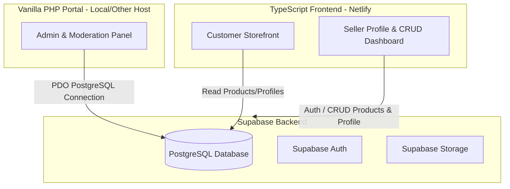

# DigitalMarketing: Profile-Based Multi-Seller Marketplace

DigitalMarketing is a profile-based online shopping platform where business owners can set up public seller profiles, post their products, and manage their inventory. The system integrates a modern TypeScript/HTML customer storefront and seller dashboard (deployed to Netlify) with a Vanilla PHP admin panel, all connected to a single Supabase PostgreSQL database.

---

## Architecture Overview

---

## Database Schema (Supabase)

We will define two main tables with Foreign Key relationships and Row Level Security (RLS):

### 1. `profiles`
Stores business owner account information.
* `id` (uuid, primary key, references `auth.users`)
* `business_name` (text, not null)
* `description` (text)
* `logo_url` (text)
* `contact_email` (text)
* `created_at` (timestamp with time zone)

### 2. `products`
Stores products posted by business owners.
* `id` (uuid, primary key)
* `profile_id` (uuid, references `profiles.id` on delete cascade)
* `name` (text, not null)
* `description` (text)
* `price` (numeric, not null)
* `stock` (integer, default 0)
* `image_url` (text)
* `created_at` (timestamp with time zone)

---

## Proposed Changes

We will create a beautiful, highly interactive frontend application with modern glassmorphic cards, smooth page transitions, and responsive grid layouts.

### Frontend Components (Vite + TypeScript)
We will set up a Vite-based TypeScript project. This allows us to use modern ES modules, compile TypeScript natively, and deploy to Netlify in one click.

#### [NEW] [package.json](file:///c:/private/final/package.json)
* Setup dependencies: `typescript`, `@supabase/supabase-js`, `vite`, `lucide-static` (for modern icons).
* Build scripts for Vite.

#### [NEW] [index.html](file:///c:/private/final/index.html)
* Multi-view single page app containing three main views:
  1. **Marketplace Storefront:** Customers browse products, filter by seller, and view business owner cards.
  2. **Seller Profile Page:** Public page dedicated to a single seller showing their business details and products.
  3. **Seller Dashboard:** Password-protected dashboard (using Supabase Auth) where sellers manage their profile info and perform CRUD operations on their products.

#### [NEW] [src/style.css](file:///c:/private/final/src/style.css)
* Custom CSS variables for a slate/emerald premium color scheme.
* Responsive layouts, smooth CSS animations, dark mode variables, glassmorphism card templates, and loading skeletons.

#### [NEW] [src/supabaseClient.ts](file:///c:/private/final/src/supabaseClient.ts)
* Initializes the Supabase JS client using the public URL and Anon Key.

#### [NEW] [src/app.ts](file:///c:/private/final/src/app.ts)
* Core UI router and controller. Handles tab routing, modal rendering, search filtering, and auth state changes.

#### [NEW] [src/marketplace.ts](file:///c:/private/final/src/marketplace.ts)
* Renders the marketplace feed and handles customer views.

#### [NEW] [src/dashboard.ts](file:///c:/private/final/src/dashboard.ts)
* Form handling and interactive event listeners for profile updates and product CRUD operations (Create, Read, Update, Delete).

---

### Backend Components (Vanilla PHP Admin Panel)
A server-side portal for managing the platform.

#### [NEW] [php/db.php](file:///c:/private/final/php/db.php)
* Connects directly to the Supabase PostgreSQL database using PHP Data Objects (PDO) with PostgreSQL support.

#### [NEW] [php/index.php](file:///c:/private/final/php/index.php)
* Admin dashboard showing summary stats (total sellers, total products).
* Lists all seller profiles and allows admins to edit them.

#### [NEW] [php/products.php](file:///c:/private/final/php/products.php)
* A grid list of all products across all sellers.
* Allows administrators to moderate/delete products that violate terms.

---

## Verification Plan

### Automated & Manual Testing
1. **Local Dev Server:** Start Vite via `npm run dev` and test user signup, seller profile setup, adding a product, updating a product, deleting a product, and customer filtering.
2. **PHP Admin Local Server:** Run a local PHP server to verify PDO database connection to Supabase and execute admin-level updates.
3. **Build Check:** Run `npm run build` to verify no TypeScript or bundling compilation errors exist.

### GitHub & Netlify Deployment
1. Initialize Git repository and push code to GitHub.
2. Connect the repository to Netlify for automatic build and deploy.
3. Set environment variables on Netlify.
4. Verify dynamic live data interaction on the deployed Netlify URL.
